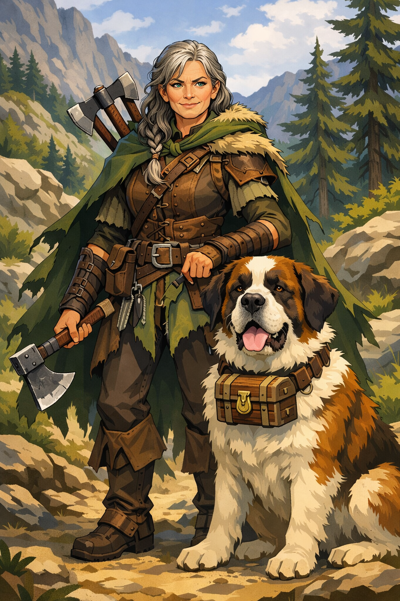

> *"Unfortunately, Adventuring doesn't have a great retirement plan"*

|                |                                           |
| -------------- | ----------------------------------------- |
| **Class**      | [Ranger](../_Reference/Classes/Ranger.md) |
| **Level**      | 3                                         |
| **Race**       | [Human](../_Reference/Races/Human.md)     |
| **Alignment**  | Neutral Good                              |
| **Background** | Folk Hero                                 |

|            |        |
| ---------- | ------ |
| **Age**    | 65     |
| **Height** | 5'4"   |
| **Weight** | 140lbs |
|            |        |

---
## Stats

| **HP** | **AC** | **Speed** | **Initiative** |
| ------ | ------ | --------- | -------------- |
| 23     | 15     | 30 feet   | +1             |

| **Hit Die** | **Prof Bonus** | **Max HP** | **Temp HP** |
| ----------- | -------------- | ---------- | ----------- |
| 3d10        | +2             | 23         | 0           |

| **Senses**             | #   |
| ---------------------- | --- |
| **Passive Perception** | 14  |

---
## Actions

| **Weapon**         | **Base Damage** | **Bonus (to Hit)** | **Bonus (Damage)** | **Notes**                   |
| ------------------ | --------------- | ------------------ | ------------------ | --------------------------- |
| Handaxe            | 1d6 Slashing    | +4 (Prof + Str)    | +2 (Str)           |                             |
| Handaxe (off-hand) | 1d6 Slashing    | +4 (Prof + Str)    | +2 (Str)           | Available as a Bonus Action |
| Handaxe (thrown)   | 1d6 Slashing    | +4 (Prof + Str)    | +2 (Str)           | Ranged (20/60)              |
|                    |                 |                    |                    |                             |
*Note: Savage Attacker allows you to reroll 1 melee damage dice per turn*
*Note: Elenore has Mastery in Handaxes, allowing her to use their mastery ability, [Vex](Abilities/Vex.md)*

## Spellcasting

| **Spell Save DC** | **Spell Attack Modifier** | **Spellcasting Ability** |
| ----------------- | ------------------------- | ------------------------ |
| 14                | +6                        | WIS                      |

| **Spells Known**   | **1st** | **2nd** | **3rd** | **4th** | **5th** |
| ------------------ | ------- | ------- | ------- | ------- | ------- |
| 3                  | 3       |         |         |         |         |
| **Current Slots:** | 3       |         |         |         |         |
**Spells**
- *Special* - [Hunter's Mark](../_Reference/Spells/Hunter's%20Mark.md) (2x / long rest)
- *Level 1 - [Cure Wounds](../_Reference/Spells/Cure%20Wounds.md), [Speak with Animals](../_Reference/Spells/Speak%20with%20Animals.md), [Goodberry](../_Reference/Spells/Goodberry.md) (maybe)*

---

## Abilities

|                  | **STR** | **DEX** | **CON** | **WIS** | **INT** | **CHR** |
| ---------------- | ------- | ------- | ------- | ------- | ------- | ------- |
| **Stats**        | 14      | 12      | 14      | 19      | 6       | 12      |
| **Modifier**     | +2      | +1      | +2      | +4      | -2      | +1      |
| **Saving Throw** |         |         |         |         |         |         |
*Variant Human:* +1 CON, +1 WIS

---
## Skills
| #   | Skill           | Ability | Proficiency |
| --- | --------------- | ------- | ----------- |
| +1  | Acrobatics      | *Dex*   |             |
| +6  | Animal Handling | *Wis*   | True        |
| -2  | Arcana          | *Int*   |             |
| +4  | Athletics       | *Str*   | True        |
| +1  | Deception       | *Cha*   |             |
| -2  | History         | *Int*   |             |
| +8  | Insight         | *Wis*   | Expertise   |
| +1  | Intimidation    | *Cha*   |             |
| -2  | Investigation   | *Int*   |             |
| +4  | Medicine        | *Wis*   |             |
| +0  | Nature          | *Int*   | True        |
| +6  | Perception      | *Wis*   | True        |
| +1  | Performance     | *Cha*   |             |
| +1  | Persuasion      | *Cha*   |             |
| -2  | Religion        | *Int*   |             |
| +1  | Sleight of Hand | *Dex*   |             |
| +1  | Stealth         | *Dex*   |             |
| +6  | Survival        | *Wis*   | True        |
## Feats and Traits
*Variant Human Feat*
**Savage Attacker** - Once per turn when you roll damage for a melee weapon attack, you can reroll the weapon’s damage dice and use either total.

*Folk Hero Background*
**Rustic Hospitality** - Since you come from simple folk, you fit in among them. You can find a place to hide, rest, or recuperate among other commoners, unless you have shown yourself to be a danger to them. They will shield you from the law or anyone else searching for you, though they will not risk their lives for you.

*Ranger Class*
**Fighting Style: Two-Weapon Fighting** - When you engage in two-weapon fighting, you can add your ability modifier to the damage of the second attack
**Favored Enemy** - Cast [Hunter's Mark](../_Reference/Spells/Hunter's%20Mark.md) up to 2x per long rest without expending a spell slot

---
## Proficiencies
*Variant Human*
- **Skill: Athletics**
*Folk Hero Background*
- **Skill: Animal Handling**
- **Skill: Survival**
- **Tools: [Calligrapher's Supplies](../_Reference/Equipment/Calligrapher's%20Supplies.md)**
- **Vehicles (Land)**
*Ranger Class*
- **Armor: Light**
- **Armor: Medium**
- **Armor: Shields**
- **Weapons: Simple**
- **Weapons: Martial**
- **Saving Throw: Strength**
- **Saving Throw: Dexterity**
- **Skill: Insight**
- **Skill: Nature**
- **Skill: Perception**
- **Fighting Style: Two Weapon Fighting Style**
- **Mastery: Handaxe**
- **Mastery: Greataxe**

---
## Languages
*Racial Languages (Human)*
- **Common**
- **Ghukliak (Goblin)**
*Class Languages (Ranger: Deft Explorer)*
- **Dwarvish**
- **Gnomish**

---
## Equipment

| **CP** | **SP** | **GP** |
| ------ | ------ | ------ |
| 0      | 0      | 17     |
*Equipped Armor*
- Scale Male (14 + DEX Mod, Max 2, Disad Stealth)
*Equipped Weapons*
- 2 Handaxes (1d6 Slashing, Light, Thrown 20/60)
- 2 Reserve Handaxes |Note: Paid for using 10 starting gp
*Tools*
- [Calligrapher's Supplies](../_Reference/Equipment/Calligrapher's%20Supplies.md)
- Shovel
- An Iron Pot
- A set of common clothes

---
## Personality
Elenore Gibbs is a simple woman, who has lived a long and satisfying life assisting commoners throughout the lands as something of a folk hero, and has at last reached the age where she is looking for a home to retire at with her loyal St. Bernard [Hank](Hank.md).

She is wise, kind, and open-minded. She believes that all folk are created equal, and that rascals who pretend otherwise could use some good old-fashioned discipline.

She is not without flaws, however, as her old age has led her to be somewhat obstinate. Her conservative nature generally balks at the idea of committing a crime or casting aside social graces, even in order to accomplish a general good. 

This general obstinance towards breaking social rules is not internally consistent with her own moral code. She has, on many occasions, taken bounties to take the lives of the jilted ex-lovers or former business partners of her clients without question. She reconciles this by believing that adventuring is dirty business, but that's no reason to be rude about it.

She is also deeply aware that her adventuring days are almost over. She's conflicted about this. She's terrified to leave the work she loves doing, but feels it's impact on her aging body and she wants to leave room for the young adventurers of tomorrow, ideally while sipping cocktails on a private lake.

While she has her dog Hank, she has found and subsequently lost several chosen families over the years, and feels that she will retire lonely and broke, with nothing to show for her decades of questing.

---
## Backstory
Elenore was born to Martin and Gertrude Gibbs, a pair of retired hunters from the city of Wander. When they had Elenore more than 60 years ago, they decided to stop following the God-King, and settle down in a farm just downriver from the city of Opus.

She grew up doing work on the farm: chopping wood, planting seeds, and herding cattle with her pet dog Hank. Elenore lived a simple childhood, backed by strong family values. It were these family values that led her to accept her first quest at the age of 16, to help pay off debts owed by her parents to some loan shark from Gone.

Her first quest was simple. Kill a grizzly bear, save the kids, and collect the gold. It went off without a hitch, and the look in the parents eyes when their children had been safely returned to them had Elenore instantly hooked on the profession.

When she was in her early twenties, she embarked on another quest to broker a deal between a group of Fae and some local townsfolk who were planning to log a sacred forest. As a reward, the Fae revealed to her their Fountain of Longevity, which promised to extend her lifespan far beyond the regular human lifespan. Elenore saw a more pressing need, and had her dog Hank drink from the fountain, so that the two may grow old together as lifelong companions. While this angered the Fae out of disrespect, they allowed her to leave their realm never to return again.

Since then, she has built up quite a name for herself as a kind, helpful, and competent woman who uplifts others without hesitation. This image comes into question on occasion, as some sense that she is more in this career for the love of the game, rather than some innate altruism.

Her parents have long since passed, of natural causes, and Elenore was able to provide for their funeral. They are buried underneath a large oak tree on the family farm, whose deed was long lost to Elenore to pay off debts to some family in Opus who had funded medical care for her parents near the end of their lives. 

Elenore is a veritable hero to many people in the realm, and a household name among bards and more experienced adventurers. Since her prime, her power has waned and her tales are not sung as frequently. She is now on a quest to find a perfect home to retire in, and collect the gold to fund it's purchase, before eventually she and Hank can be buried underneath a tree together and join her parents in the Great Beyond.

---
